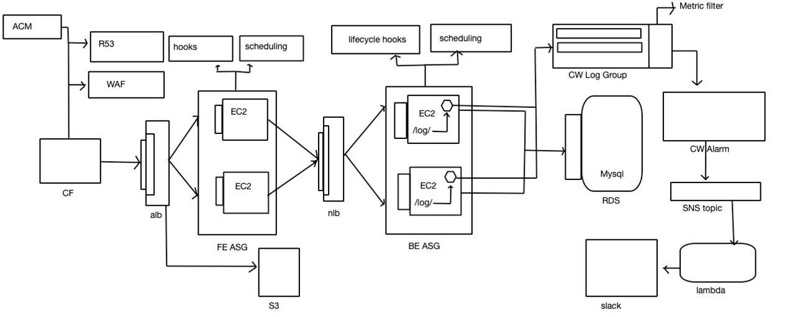
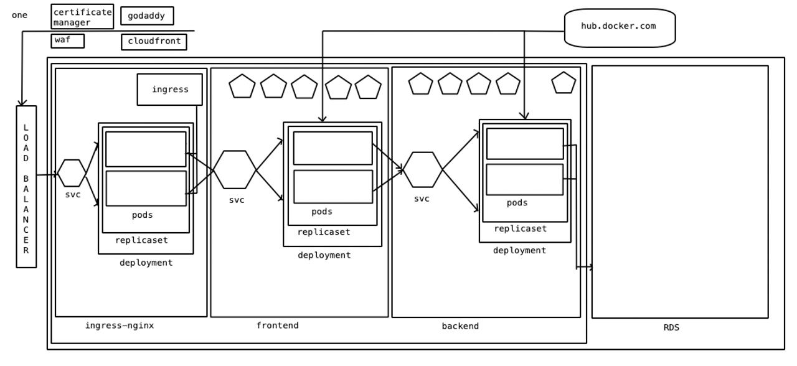
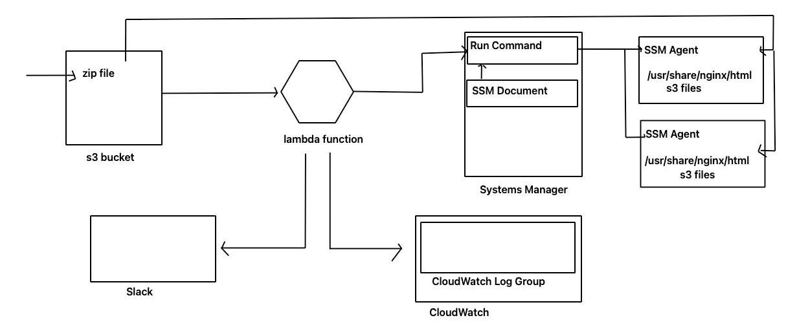

# DevOps Projects ⚙️

A curated collection of real-world DevOps and cloud infrastructure projects — from IaC to CI/CD pipelines — showcasing automated, scalable, multi-cloud architectures and cloud-native deployments.

## 🚀 Projects & Highlights  

| Project / Use-Case | Description & Key Technologies |
|-------------------|-------------------------------|
| **Modular Infrastructure Automation** | Infrastructure-as-Code using Terraform: reusable, environment-agnostic modules for VPCs, Kubernetes clusters (EKS), IAM policies, S3, networking, and more. Enables repeatable deployments across dev / QA / prod. |
| **Containerized Microservices & Cluster Deployments** | Kubernetes (EKS/ECS Fargate), Docker, Helm charts + manifest templates — for deploying microservices, managing configuration, scaling, and rolling updates. |
| **CI/CD Pipelines & Build Automation** | Jenkins pipelines (with Maven builds, Docker image packaging, ECR push), Shared Libraries for standardized workflows, environment-based promotions (Dev → QA → Prod), automated code quality scans (e.g. SonarQube). |
| **Automated Workflows & Scheduled Jobs** | Kubernetes CronJobs & lightweight container images performing scheduled tasks (e.g. data processing, market-data ingestion), with notifications via AWS SNS / Slack. |
| **Monitoring, Observability & Alerting** | Prometheus + Grafana monitoring, custom dashboards, alerting via Alertmanager + Slack integration, and centralized log-based alerts (AWS CloudWatch + Lambda + SNS). |
| **High-Availability & Resilient Architecture** | Route 53 health-check based failover routing, remote-state management for Terraform stacks, modular multi-stack design — ensuring infrastructure is robust and production-ready. |

## Architecture Diagrams
**Cloud Project**

**Kubernetes Project**
 

**Lambda Project**
 

## 🛠️ Tech Stack  

- **Cloud & Infrastructure:** AWS (EKS, ECS Fargate, VPC, IAM, S3, Route 53, CloudWatch)  
- **Infra-as-Code & Deployment:** Terraform, Helm, Ansible, Docker, Kubernetes  
- **CI/CD & Automation:** Jenkins, Maven, Docker, Shared Libraries, Shell / Bash / Python scripts  
- **Monitoring & Logging:** Prometheus, Grafana, CloudWatch, SNS, Slack integration  
- **Languages & Scripting:** Bash, Python (Boto3), Dockerfiles / containerization tooling  

## 🎯 Why This Repo  

- Demonstrates real-world infrastructure design and deployment — not just toy projects.  
- Emphasizes automation, repeatability, and scalability: from infra provisioning to microservices orchestration.  
- Serves as a reference / starting point if you want to build cloud-native, DevOps-centric systems using industry-standard tools and workflows.  
- Useful for sharing with recruiters, peers, or potential collaborators to show hands-on DevOps and cloud experience.  

## 📂 Structure of the Repository  

